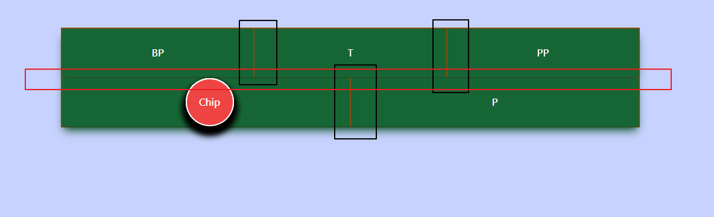
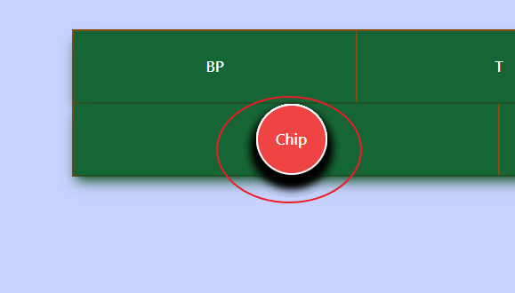

# Demo Project


[DemoLink](https://josephmtsai.github.io/vue_demo/)

### Pre Require

Tailwind css
GSAP3

install

```
yarn
```

```
yarn dev
```

### Design

> bubble event
> animation playback 概念
> Teleport 傳送物件
> flex

### Function

1. 排版 flex , hover function

> 利用 flex justify-center + align-center 排版



> 黑框的部分使用 gap 讓他有邊框
> 紅框的部分使用 margin top 讓第二個邊框上方有 2px 空間

```css
first: mt-0 mt-[2px];
```

> 最外框就使用 padding 讓他有空間 再放底色就可以

```css
p-[2px]
```

2. 殘影 animation (Click P Bet)

> 這個功能最難 主要是使用 GSAP 的 FromTo 功能 先設定 結束 以及 初始位置 讓他倒回撥放 跟錄影帶一樣
> 並且事先 先定義多個元件 使用 delay 製造殘影. 當觸發 click 去計算 要從哪邊位移 以及是移動到哪一個元件
> 以及紀錄他的位置 如果上面有被其他元件覆蓋到 可以使用紀錄的位置再度觸發
> [Reference](<https://greensock.com/docs/v3/GSAP/gsap.fromTo()>)

```html
<div
  id="t_bet"
  class="flex-grow w-1/3 flex justify-center items-center text-white gap-2 bg-green-800 hover:bg-green-400"
  v-on:click.stop="placeBet($event, '#t_bet')"
>
  T
  <Bets
    v-for="index in betsItem"
    :key="index"
    class="z-[-1]"
    :id="'t_chip' + index"
  ></Bets>
</div>
```

```javascript
currentY.value =
  chip.value.getBoundingClientRect().y -
  event.target.getBoundingClientRect().y -
  event.target.getBoundingClientRect().height / 2 +
  chip.value.getBoundingClientRect().height / 2;
currentX.value =
  chip.value.getBoundingClientRect().x -
  event.target.getBoundingClientRect().x -
  event.target.getBoundingClientRect().width / 2 +
  chip.value.getBoundingClientRect().width / 2;
```

> 最主要是透過點擊的 event 的物件 算出雙方位置 再傳入給 Gsap 執行就可以

3. Place Bet animation

作法只需要把 2 的 element 改成數量 1 即可

4. Click animation
   > 在 bet table 裡面點選是黃色框
   > 在外圍是黑色框 以及比較小的位移

```html
<div
  class="w-[50px] h-[50px] absolute clickCircle z-20"
  v-if="!isBetCircle"
  v-bind:style="{ top: yPosition, left: xPosition }"
></div>
<div
  class="w-[50px] h-[50px] absolute clickBetCircle z-20"
  v-if="isBetCircle"
  v-bind:style="{ top: yPosition, left: xPosition }"
  v-on:click="placeBet()"
></div>
```

> 作法 當點擊畫面 移動 element 位置 並且視情況 觸發 bubble event
> 這裡的 placeBet() 用於觸發殘影 . 如果沒有傳遞值進去 視為位置沒有改變 使用之前點選的 bet 去觸發殘影

5. Bets



```html
<div v-for="bet in betsSetting">
  <div v-if="bet.display">
    <Teleport :to="bet.id" :disabled="!bet.display">
      <Bets class="absolute t-[300px] l-[300px]"></Bets>
    </Teleport>
  </div>
</div>
```

> 事先 先產生對應的下注的 TABLE 的 bet . 當點選到 bet 的時候 將 disable 以及 id 讓 Teleport 觸發 傳送到元件上方
